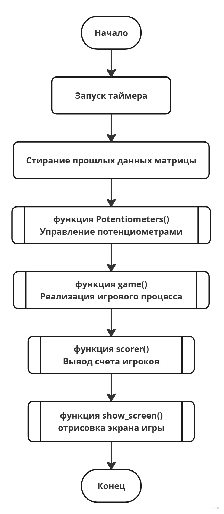
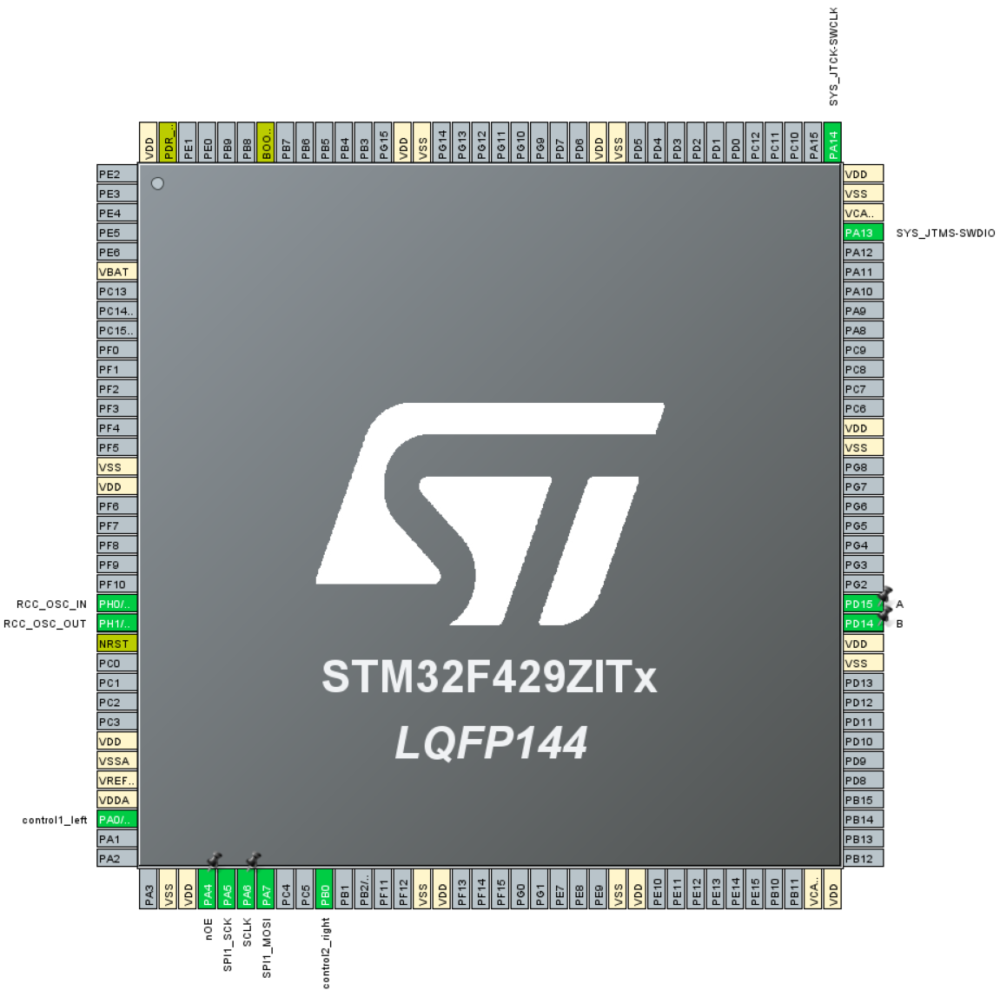
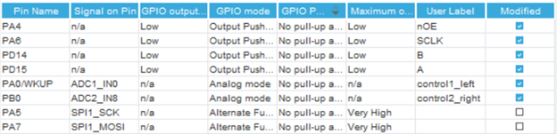
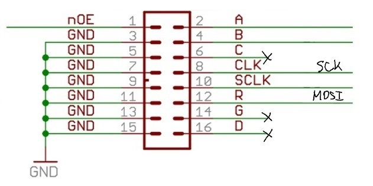
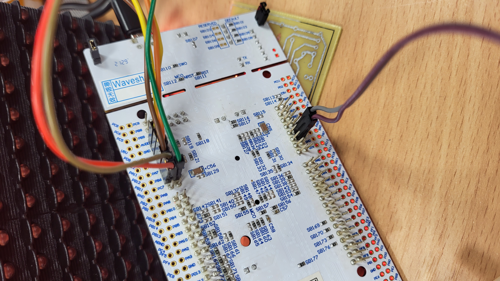
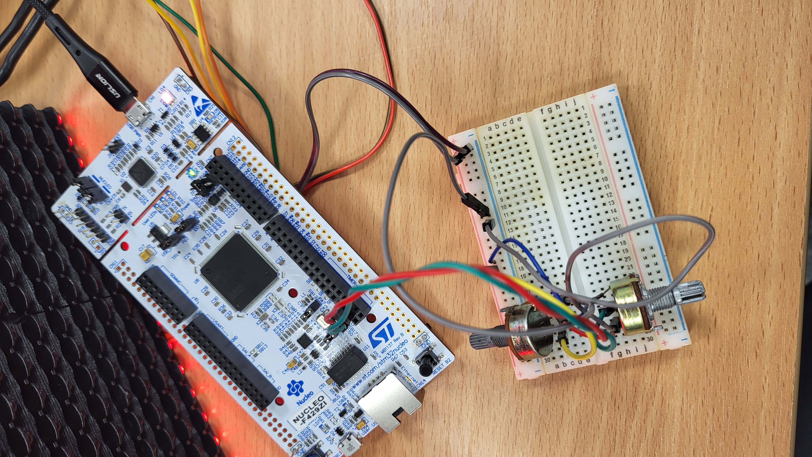

# Лабораторная работа №1 по "Встраиваемым системам"
# Тема: Знакомство с SPI. Применение библиотек при разработке ПО под STM32

# Задание:
Реализовать игру “Пинг-Понг” и вывести картинку с помощью протокола SPI на светодиодную панель P10. Суть данной игры будет заключаться в том что на прямоугольном поле 32х16 окруженном с верхней и нижней стороны стенками по бокам расположены движимые вертикально платформы, отбивающие летящий шарик, если шарик попадает мимо платформ, игра заканчивается и начинается заново, выдавая счет игроков в начале нового раунда. Движение платформ управляется отдельно, шарик отскакивает от платформ и стенок в зависимости от своей траектории движения

# Описание
В работе была использована отладочная плата **NUCLEO STM32F429ZITx** на базе микроконтроллера серии STMicroelectronics. Управление должно быть организовано при помощи подключенных потенциометров.
Для выполнения задания необходимо изучить принцип работы интерфейса SPI и связи со светодиодной панелью P10 с размерностью 16x32 пикселей. Для выполнения данного задания был изучен материал на сайте Хабр по ссылке: https://habr.com/ru/articles/372215/
Листинги программного кода предоставлены в директории `/S5_LB1.8` в файлах `/Core/SRC/main.c` и `/Core/SRC/stm32f4xx_it.c`. 
Алгоритм программы представлен с помощью блок-схемы:

Познакомиться с итоговым выполнением работы и реализаией игрового процесса игры "Пинг-понг" можно при просмотре видео по ссылке на Гугл-диск: https://drive.google.com/file/d/13UrktWx37nviBoMGRGPE6KyqZ2AADF9k/view?usp=sharing 

# Инструкция выполнения проекта
Для исправной работы необходимо следовать нескольким пунктам:
1. Настройка проекта в STM32CubeMX
**Выполните копирование из папки `/S5_LB1.8/` файл `S5_LB1.8.ioc` в вашу директорию и запустите данную программу**

Для реализации проекта, в STM32CubeMX были активированы пины PA0 и PB0 как ADC Mode в IN0 b IN8 соответственно для того, чтобы подключить на него потенциометры для передачи аналогово сигнала. Так же был активирован SPI1 в режиме Transmit Only Master и пины PA4 (nOE), PA8 (SCLK), PD15 (A), PD14 (B) в режиме GPIO-Output для передачи информации на светодиодную панель. Для реализации движения шарика и управления платформой был активирован TIM1 в режиме Internal Clock с параметрами: Prescaler: 100-1, Counter Period: 1800-1, чтобы добиться частоты обновления таймера 1000 Гц или периода 1 мс.
**На рисунках снизу показаны подключенные порты. Сгенерируйте код и следуйте следующим пунктам**

2. Настройка проекта в STM32CubeIDE
**Выполните копирование из папки `/S5_LB1.8/Core/` в вашу директорию. После запустите файл `.project`. Запустите отладку программы. Если критических ошибок не найдено, иначе проверяем наличие всех файлов. Следуем дальше.**

3. Подключение светодиодной панели P10 и потенциометров к отладочной плате STM32
**Необходимо подключить светодиодную панель согласно данной схеме:**

**После этого необходимо выполнить подключение потенциометров, как показано на рисунках:**

 

**Светодиодная панель подключается к преобразователю напряжения с выходом 5V. Если все сделано верно следуем дальше**
4. Отладка и загрузка программы
**Необходимо выполнить отладку и загрузку программы в STM32CubeIDE. Если все было подключено верно то на светодиодной панели запустит игра как было показано ранее в видео. Если картинка выводится некорректно необходимо проверить подключение всех портов к отладочной плате и лед-панели**
