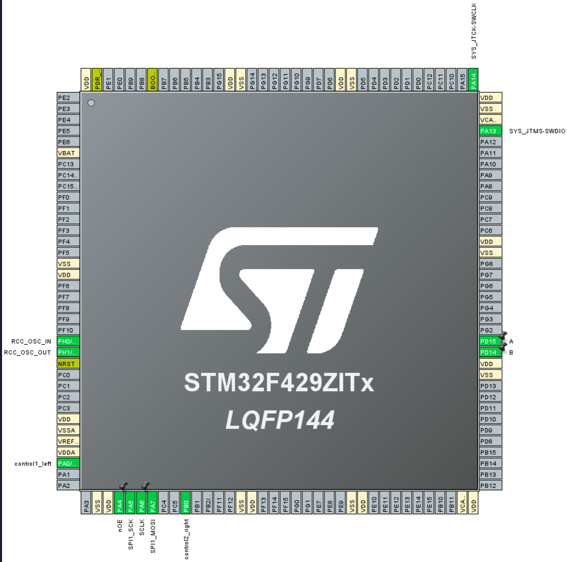

# Лабораторная работа №1 по "Встраиваемым системам"
# Тема: Знакомство с SPI. Применение библиотек при разработке ПО под STM32

# Задание:
Реализовать игру “Пинг-Понг” и вывести картинку с помощью протокола SPI на светодиодную панель P10. Суть данной игры будет заключаться в том что на прямоугольном поле 32х16 окруженном с верхней и нижней стороны стенками по бокам расположены движимые вертикально платформы, отбивающие летящий шарик, если шарик попадает мимо платформ, игра заканчивается и начинается заново, выдавая счет игроков в начале нового раунда. Движение платформ управляется отдельно, шарик отскакивает от платформ и стенок в зависимости от своей траектории движения

# Описание
В работе была использована отладочная плата **NUCLEO STM32F429ZITx** на базе микроконтроллера серии STMicroelectronics. Управление должно быть организовано при помощи подключенных потенциометров.
Для выполнения задания необходимо изучить принцип работы интерфейса SPI и связи со светодиодной панелью P10 с размерностью 16x32 пикселей. Для выполнения данного задания был изучен материал на сайте Хабр по ссылке: https://habr.com/ru/articles/372215/

Листинги программного кода предоставлены в директории `/S5_LB1.8` в файлах `/Core/SRC/main.c` и `/Core/SRC/stm32f4xx_it.c`. 

Алгоритм программы представлен с помощью блок-схемы:

Познакомиться с итоговым выполнением работы и реализацией игрового процесса игры "Пинг-понг" можно при просмотре видео по ссылке на Гугл-диск: https://drive.google.com/file/d/13UrktWx37nviBoMGRGPE6KyqZ2AADF9k/view?usp=sharing 

# SPI - Serial Peripheral Interface

(**Serial Peripheral Interface**, **SPI bus** —
последовательный периферийный интерфейс, шина SPI)
— последовательный синхронный стандарт передачи данных,
предназначенный для обеспечения
простого и недорогого высокоскоростного сопряжения
микроконтроллеров и периферии.

В SPI используются четыре цифровых сигнала:

* **MOSI** — выход ведущего, вход ведомого
(англ. Master Out Slave In).
Служит для передачи данных от ведущего устройства ведомому.

* **MISO** — вход ведущего, выход ведомого
(англ. Master In Slave Out).
Служит для передачи данных от ведомого устройства ведущему.

* **SCLK** или **SCK** — последовательный тактовый сигнал
(англ. Serial Clock).
Служит для передачи тактового сигнала для ведомых устройств.

* **CS** или **SS** — выбор микросхемы, выбор ведомого
(англ. Chip Select, Slave Select).

Конкретные имена портов интерфейса SPI могут различаться
в зависимости от производителя аппаратных средств,
при этом возможны следующие варианты:

| Порт | Master                                | Slave         |
|------|---------------------------------------|---------------|
| MISO | SOMI, SDI, RX                         | SOMI, SDO, TX |
| MOSI | SIMO, SDO, TX                         | SIMO, SDI, RX |
| SCLK | SCK, CLK, SPC (SPI serial port clock) | <---          | 
| SS   | nCS, CS, CSB, CSN, NSS, nSS, STE, SYN | <---          |

#### Прием и передача данных в SPI
Передача осуществляется пакетами.
Длина пакета, как правило, составляет 1 байт (8 бит),
при этом известны реализации SPI с иной длиной пакета,
например, 4 бита.
Ведущее устройство инициирует цикл связи установкой
низкого уровня на выводе выбора подчиненного устройства (SS)
того устройства, с которым необходимо установить соединение.
При низком уровне сигнала SS:

* схемотехника ведомого устройства находится в активном состоянии;
* вывод **MISO** переводится в режим «выход»;
* тактовый сигнал **SCLK** от ведущего устройства
воспринимается ведомым и вызывает считывание
на входе MOSI значений передаваемых от ведущего
битов и сдвиг регистра ведомого устройства.

Подлежащие передаче данные ведущее и ведомое устройства помещают
в сдвиговые регистры. После этого ведущее устройство начинает
генерировать импульсы синхронизации на линии **SCLK**, что приводит
к взаимному обмену данными. Передача данных осуществляется бит
за битом от ведущего по линии **MOSI** и от ведомого по линии **MISO**.
Передача осуществляется, как правило, начиная со старших битов,
но некоторые производители допускают изменение порядка передачи
битов программными методами. После передачи каждого пакета данных
ведущее устройство, в целях синхронизации ведомого устройства,
может перевести линию **SS** в высокое состояние.

#### Преимущества и недостатки интерфейса SPI
##### Преимущества:

* Полнодуплексная передача данных по умолчанию.

* Более высокая пропускная способность по сравнению с I²C или SMBus.

* Возможность произвольного выбора длины пакета, длина пакета не ограничена восемью битами.

* Простота аппаратной реализации:

  * более низкие требования к энергопотреблению по сравнению с I²C и SMBus;

  * возможно использование в системах с низкостабильной тактовой частотой;

  * ведомым устройствам не нужен уникальный адрес, в отличие от таких интерфейсов, как I²C, GPIB или SCSI.

* Используется только четыре вывода, что гораздо меньше, чем для параллельных интерфейсов.

* Однонаправленный характер сигналов позволяет при необходимости легко организовать гальваническую развязку между
ведущим и ведомыми устройствами.

* Максимальная тактовая частота ограничена только быстродействием устройств, участвующих в обмене данными.

##### Недостатки
* Необходимо больше выводов, чем для интерфейса **I²C**.
* Ведомое устройство не может управлять потоком данных.
* Нет подтверждения приема данных со стороны ведомого устройства (ведущее устройство может передавать данные «в никуда»).
* Нет определенного стандартом протокола обнаружения ошибок.
* Отсутствие официального стандарта, что делает невозможным сертификацию устройств.
* По дальности передачи данных интерфейс **SPI** уступает таким стандартам, как **UART** и **CAN**.
* Наличие множества вариантов реализации интерфейса.
* Отсутствие поддержки горячего подключения устройств.

### P10 Светодиодная панель
**P10 Светодиодная панель** или **P10 Led Board** представляет собой
панель состоящую из корпуса, светодиодов и управляющих микросхем.
Размерность светодиодной панели в пикселях равна 16 по высоте и
32 по ширине. Управление светодиодной панелью осуществляется
через интерфейс SPI, что позволяет подключать несколько панелей
последовательно и масштабировать размерность панели.

Распиновка входного разъёма

На разъёме:
* Пины 6, 14, 16 (C, G, D) — не используются (возможно они используются в 3-цветных матрицах).
* Пины 2 и 4 (A и B) — задают,
какая из 4 групп светодиодов экрана работает в данный момент.
Матрицы используют динамическую индикацию, поочерёдно переключая 4 группы светодиодов в зависимости от логических
уровней на ножках A и B.
На плате эти сигналы приходят на дешифратор D18, который открывает 1 из 4 групп P-канальных полевиков,
тем самым подавая +5В на аноды светодиодов выбранной группы.
* Пин 1 (nOE) — разрешает работу матрицы (лог. 0 гасит все матрицы в цепочке).
Логика работы этого пина реализована на элементах НЕ в D19 и дешифраторе D18.
* Пины 8 и 12 (CLK и R) — линии клока и данных синхронного последовательного интерфейса.
Их подключаем к SCK и MOSI интерфейса SPI микроконтроллера.
* Пин 10 (SCLK) — по переднему фронту защёлкивает переданные в сдвиговые регистры данные на их выходы.
Сдвиговые регистры подключены к катодам светодиодов матрицы.
По этой причине передаваемые данные нужно инвертировать (светодиод будет гореть при лог. 0)

Ниже приведена принципиальная схема светодиодной панели максимально приближённая к имеющейся

#### Логика обновления экрана (точнее четверти экрана) выглядит следующим образом:
1. Выдаём по SPI данные для сдвиговых регистров.
Для одной матрицы 32x16 это 16 байт (16 8-битных регистров).
2. Устанавливаем лог. 0 на ножке **nOE**.
3. Устанавливаем лог. уровни на ножках A и B в соответствии
с обновляемой группой светодиодов (одной из четырёх).
Это подаёт +5В на аноды светодиодов выбранной группы.
4. Выдаём на ножку **SCLK** короткий положительный импульс.
Это подаёт землю на катоды светодиодов в соответствии
с загруженными в регистры байтами.
5. Устанавливаем лог. 1 на ножке **nOE**.
При этом четверть экрана (одна группа светодиодов)
загорается и горит до следующего обновления следующей группы светодиодов.

Повторяем пункты **1-5** с постоянным периодом.

# Инструкция выполнения проекта
Для исправной работы необходимо следовать нескольким пунктам:
1. Настройка проекта в STM32CubeMX
**Выполните копирование из папки `/S5_LB1.8/` файл `S5_LB1.8.ioc` в вашу директорию и запустите данную программу**

Для реализации проекта, в STM32CubeMX были активированы пины PA0 и PB0 как ADC Mode в IN0 b IN8 соответственно для того, чтобы подключить на него потенциометры для передачи аналогово сигнала. Так же был активирован SPI1 в режиме Transmit Only Master и пины PA4 (nOE), PA8 (SCLK), PD15 (A), PD14 (B) в режиме GPIO-Output для передачи информации на светодиодную панель. Для реализации движения шарика и управления платформой был активирован TIM1 в режиме Internal Clock с параметрами: Prescaler: 100-1, Counter Period: 1800-1, чтобы добиться частоты обновления таймера 1000 Гц или периода 1 мс.
**На рисунках снизу показаны подключенные порты. Сгенерируйте код и следуйте следующим пунктам**

2. Настройка проекта в STM32CubeIDE
**Выполните копирование из папки `/S5_LB1.8/Core/` в вашу директорию. После запустите файл `.project`. Запустите отладку программы. Если критических ошибок не найдено, иначе проверяем наличие всех файлов. Следуем дальше.**

3. Подключение светодиодной панели P10 и потенциометров к отладочной плате STM32
**Необходимо подключить светодиодную панель согласно данной схеме:**

**После этого необходимо выполнить подключение потенциометров, как показано на рисунках:**

 

**Светодиодная панель подключается к преобразователю напряжения с выходом 5V. Если все сделано верно следуем дальше**

4. Отладка и загрузка программы
**Необходимо выполнить отладку и загрузку программы в STM32CubeIDE. Если все было подключено верно то на светодиодной панели запустит игра как было показано ранее в видео. Если картинка выводится некорректно необходимо проверить подключение всех портов к отладочной плате и лед-панели**
